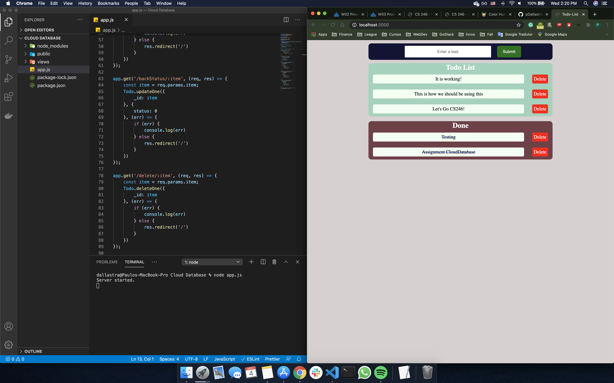

# OVERVIEW

This is a TODO List using Cloud Database. The little App will give you the chance to add new items to the "TODO List" section, send it to the "Done" section, and delete it.
The Cloud database used for this assingment was MongoDB

## Development Environment

* Visual Studio Code
* Node.JS
* Express
* EJS
* Mongoose
* MongoDB

## Execution

You can type on your terminal "node app.js" while in the main folder to execute for the project.
Go to localhost:3000 and start using the project.

